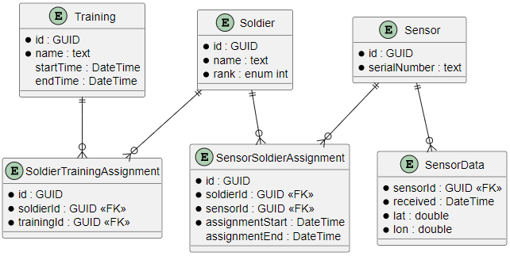

# **Map Data Visualizer** assessment

## Assessment key-points
- Provide real-time position movements of soldiers on a map, based on sensor data
- Access more information of the soldier by clicking on the marker (latitude, longitude, rank, country and training information)
- Solution should be optimized for large data volumes and frequent updates of markers
- Document solution with ERD and architectural diagrams
- Add unit and integration tests for the movement of the soldier
- Data should be fetched in via JSON-object

## Approach
The `Map Data Visualizer` is implemented with the dependency injection pattern.
With an MSSQL-database as backbone of the application, the DB-schema is created and maintained with the `code first`-paradigm.  
Data should be read and written over repositories, which implement interfaces, to have full flexibility for testing.  
The UI should follow a proper MVVM-approach in order to decouple backend and frontend relevant code. Incoming position-data should be gathered, stored to the database and update it's dependent element on the map in a defined interval.  
The position-update should be propagated via events through the viewmodel, to only update the relevant items.  
To work with a first batch of data, a function ensures the seed of test-data during application startup.  
NLog is configured to log messages and exceptions.

## Achieved results within 5hrs assessment-time
✅ ERD  
✅ WPF .NET-8 application with dependency injection set up    
✅ Database entities and repo implemented  
✅ Migration-handling and auto-upgrade implemented  
✅ Logger configured  
✅ Configuration done for unit tests

## Remarks
- Traditional SQL databases are not an ideal solution to store time-series data like positions or similar. Performance could be improved by using InfluxDB or any other time-series database
- Solution is not separated into multiple layers to save time  
- Data-seeder should be removed or if needed, implemented with a JSON-file to seed data based on external files instead of hard-coded info

## Database
Using the local SQL Server
### Migrations
To add a migration:
`dotnet-ef migrations add AddIndexes --output-dir Db/Migrations`

## ERD
